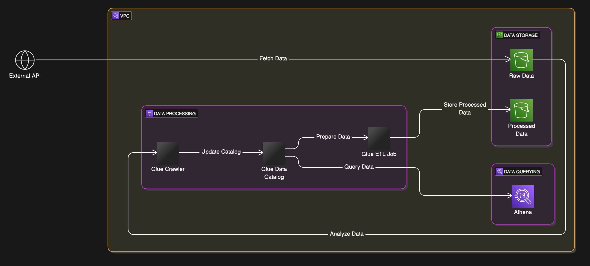

# 30 Days DevOps Challenge Day 3 - NBA Data Lake

## Overview
This system leverages Amazon S3 to store unprocessed data, creates a glue database to prepare the data for querying and configures Amazon Athea to query the data stored in the S3 bucket.
## Features
- Fetches data from an external API and stores it in an S3 bucket.
- Utilizes AWS Glue to prepare the data for querying by defining a schema and organizing the data.
- Queries the Data using Amazon Athena.
# Technical Architecture

## Technologies
- Language: Python 3.x
- AWS Services used:
  - Amazon S3 - Store raw API JSON data 
  - AWS Glue - Extract and load data fetched from API
  - Amazon Athena - Query data form S3
  - IAM - Roles and permissions 
- External API: NBA Game API(SportsData.io)
## Lessons learned
- Securing AWS services with IAM by implementing least privileges for resource access.
- Integrating external APIs into cloud-based workflows.
- Automating the creation and deletion of AWS services using Python.

